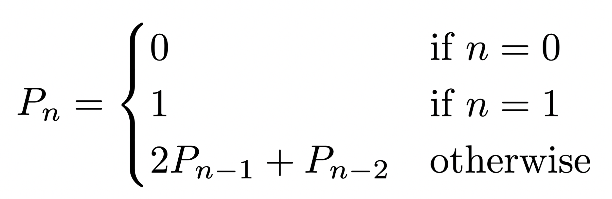
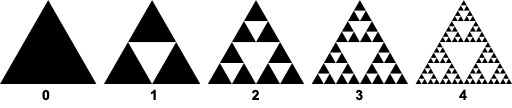

# Computer Science II
## Lab 8.0 - Recursion

A review of recursion.

This is a lab used in Computer Science II (CSCE 156, CSCE 156H) in the 
[Department of Computer Science & Engineering](https://cse.unl.edu) at the 
[University of Nebraska-Lincoln](https://unl.edu).

Chris Bourke wrote this lab, revamped by Sarah Roscoe for Summer 2022.

## Overview

### Resources

Prior to lab you should read/review the following resources.

1.  Review this laboratory handout prior to lab.

2.  Review the lecture notes on recursion.

### Lab Objectives & Topics

Following the lab, you should:

-   Be familiar with recursive methods in the Java programming language

-   Be able to evaluate and empirically analyze recursive methods

### Peer Programming Pair-Up

You will work on this lab with a partner. One of you should submit your code to the corresponding Handin assignment, or both of you should submit identical code. Handin link: https://cse-apps.unl.edu/handin

You will work in a pair programming setup. At the start of each lab, you may be randomly paired up with another student by a lab instructor. One of you will be designated the driver and the other the navigator.

The navigator will be responsible for reading the instructions and telling the driver what is to be done. The driver will be in charge of the keyboard and workstation (on Zoom, this means the driver shares their screen). Both driver and navigator are responsible for suggesting fixes and solutions together. Neither the navigator nor the driver is "in charge." Beyond your immediate pairing, you are encouraged to help and interact and with other pairs in the lab.

Each week you should try to alternate: if you were a driver last week, be a navigator next, etc. Resolve any issues (you were both drivers last week) within your pair. Ask the lab instructor to resolve issues only when you cannot come to a consensus.

Because of the peer programming setup of labs, it is absolutely essential that you complete any pre-lab activities and familiarize yourself with the handouts prior to coming to lab. Failure to do so will negatively impact your ability to collaborate and work with others which may mean that you will not be able to complete the lab.

## 1. Getting Started

Clone this project code for this lab from GitHub in Eclipse using the
URL: https://github.com/sroscoe2/CSCE156-Lab08.git. Refer to Lab 1.0 for
instructions on how to clone a project from GitHub.

## 2. Recursion

Recursion is a programming approach common to a "divide and conquer"
algorithm strategy where a problem is deconstructed into smaller
sub-problems until a "base case" is reached and the problem is solved
directly. This lab will get you familiar with recursive algorithms by
taking you through several exercises to design and analyze recursive
algorithms.

## 3. Activities

## 3.1 Analyzing the Fibonacci Sequence

Recall that the Fibonacci sequence is a recursively defined sequence
such that each term is the sum of the sequence's two previous terms:
1, 1, 2, 3, 5, 8, 13, 21, 34, 55, ... A recursive method to compute 
the Fibonacci sequence has been provided for you (see `Fibonacci`). 
The `main()` method of this class also provides code to compute the
execution time of the recursive method. Run the program for several
input instances.

This recursive method is highly inefficient: the method is called many
times on the same input. Your task will be to directly observe this by
adding code to count the exact number of times the method is called for
each input $n$.

To do this, declare a private integer array and increment entries on
each call to the recursive method depending on the input n. You may
assume that an array no larger than 50 will be needed.

## 3.2 Pell Numbers

Another recursively defined sequence similar to the Fibonacci sequence
are the Pell Numbers, defined as follows.

A program has been provided (`PellNumbers`) that computes the n-th 
Pell Number using a recursive function. The method has been defined 
using Java's `BigInteger` class, a class that supports arbitrary 
precision integers. If we were to use this
implementation to compute the 1000-th Pell Number, the computation would
take not just centuries, but billions and billions of years!!

One alternative to such inefficient recursion is to use *memoization*.
Memoization typically involves defining and filling a tableau of
incremental values whose values are combined to compute subsequent
values in the table.

For this exercise, we will instead use a Java `HashMap` to store values. 
A *map* is a data structure that allows you to define and retrieve 
key-value pairs. For this exercise, define a (static) `HashMap` that 
maps `Integer`s to `BigInteger`s (mapping $n$ to $P_n$) and use it in 
the `PellNumber` method as follows. If the value $P_n$ is already defined 
in the map, use it as a return value. Otherwise, compute the value using 
recursion, but also place the result into the map so that it will be 
available for subsequent recursive calls.

## 3.3 Palindromes

A *palindrome* is a string of characters that is the same string when
reversed. Examples of palindromes: kayak, abba, noon. An empty string
and any string of length one is a palindrome by definition.

Your task will be to design and implement a recursive algorithm to
determine if a given string is a palindrome or not. Implement the method
in the `Palindrome` class. You may find that Java's `String` class has 
several useful methods such as `charAt(int)` and `substring(int, int)`.

## 3.4 Sierpinski Triangle

A *fractal* is a geometric object that is self-similar. If you
zoom in on a fractal, it retains the same appearance or structure. One
such fractal is the Sierpinski Triangle which is formed by drawing a
triangle and removing an internal triangle drawn by connecting the
midpoints of the outer triangle's sides. This process is repeated
recursively ad infinitum.  This process is illustrated for the first four
iterations:

A graphical Java program has been provided (`SierpinskiTriangle`) 
that recursively draws the Sierpinski Triangle for a specified number 
of recursive iterations. The depth of the recursion is specified in 
the `paint()` method. It will be your task to modify this program 
to count the total number of triangles that a recursion of depth 
`n` will ultimately render.

## 4. Testing, Submitting & Grading

* Test your programs using the provided JUnit test suite(s).  Fix any
errors and completely debug your programs.
* Submit the following files through webhandin:
  * `PellNumbers.java`
  * `Palindrome.java`
* Run the grader and verify the output to complete your lab.

## Advanced Activity (Optional) 

Find the largest Fibonacci number that a Java `int` supports.  
Modify the program to use a `BigInteger` instead to support
larger numbers.  Modify it further to use memoization.  

